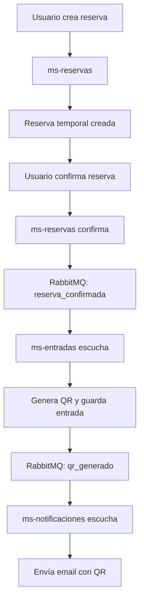

# 🎵 Encuentro - Plataforma Completa de Gestión de Conciertos

Sistema completo de gestión de conciertos implementado con **arquitectura de microservicios** en el backend y **React** en el frontend. Permite a los usuarios explorar eventos, comprar boletos, gestionar reservas y entradas, todo en una interfaz moderna y fácil de usar.


## 📦 Arquitectura del Sistema

Este proyecto está dividido en dos componentes principales:

### Backend (Microservicios)
- **Arquitectura**: 5 microservicios distribuidos
- **Comunicación**: Event-driven con RabbitMQ
- **API Gateway**: Kong
- **Base de datos**: CockroachDB (distribuida)
- **Autenticación**: JWT

### Frontend (React)
- **Tecnología**: React.js
- **Gestión de estado**: Context API
- **Estilos**: CSS personalizado y Bootstrap
- **Comunicación API**: Axios

## 🚀 Microservicios Implementados

| Microservicio         | Puerto | Descripción                                      | Autenticación |
|-----------------------|--------|--------------------------------------------------|---------------|
| `ms-usuarios`         | 3005   | Registro, login y gestión de usuarios           | JWT           |
| `ms-reservas`         | 3001   | Crear y confirmar reservas con validación       | JWT Required  |
| `ms-entradas`         | 3003   | Generar entradas con QR tras confirmar reservas | Public        |
| `ms-conciertos`       | 3004   | CRUD completo de conciertos y zonas             | JWT (Admin)   |
| `ms-notificaciones`   | 3002   | Envío de notificaciones por email (simulado)    | Public        |

## ✨ Características Principales

- **Sistema de Usuarios y Autenticación**
  - Registro de usuarios con validación de campos
  - Inicio de sesión seguro con JWT
  - Perfiles de usuario con roles (Admin/Cliente)

- **Gestión de Conciertos**
  - Exploración de conciertos disponibles
  - Vista detallada de eventos
  - Para administradores: CRUD de conciertos

- **Sistema de Reservas y Entradas**
  - Selección de zonas y cantidad de entradas
  - Creación de reservas temporales
  - Confirmación de reservas
  - Generación automática de entradas con códigos QR

## 🔄 Flujo de Eventos (Event-Driven Architecture)



## 🚀 Inicio Rápido

### 1. Prerequisitos
```bash
# Verificar que Docker y Docker Compose estén instalados
docker --version
docker-compose --version

# Verificar Node.js para frontend
node --version
npm --version
```

### 2. Levantar el Backend
```bash
cd ms-Backend
docker-compose up --build
```

### 3. Configurar Kong API Gateway
```bash
deck gateway sync kong-config.yml --kong-addr http://localhost:8001
```

### 4. Instalar e iniciar el Frontend
```bash
cd ../ms-frontend
npm install
npm start
```

## 🔧 Infraestructura

### 🔧 Servicios de Soporte

| Servicio              | Puerto | Descripción                           |
|-----------------------|--------|---------------------------------------|
| Kong API Gateway      | 8000   | Gateway unificado para todos los MS  |
| Kong Admin API        | 8001   | Administración del gateway           |
| Konga (Kong UI)       | 1337   | Interface web para Kong              |
| RabbitMQ              | 5672   | Message broker para eventos         |
| RabbitMQ Management   | 15672  | Panel de administración RabbitMQ     |
| CockroachDB (3 nodos) | 26257  | Base de datos distribuida            |
| CockroachDB UI        | 8080   | Panel de administración DB           |

## 🛠️ Stack Tecnológico

### Backend
- **Node.js/Express**: Framework para los microservicios
- **CockroachDB**: Base de datos distribuida SQL
- **Docker/Docker Compose**: Contenedores y orquestación
- **Kong**: API Gateway
- **RabbitMQ**: Message broker para comunicación entre microservicios
- **JWT**: Autenticación y autorización

### Frontend
- **React**: Biblioteca de interfaz de usuario
- **React Router**: Navegación entre páginas
- **Axios**: Cliente HTTP para comunicación con el backend
- **Context API**: Manejo de estado global
- **Bootstrap/Custom CSS**: Estilos y componentes UI
- **React-QR-Code**: Generación de códigos QR para entradas

## 🗄️ Estructura de Directorios

```
Proyecto-Final/
├── ms-Backend/
│   ├── docker-compose.yml
│   ├── kong-config.yml
│   ├── README.md
│   ├── ms-conciertos/
│   ├── ms-entradas/
│   ├── ms-notificaciones/
│   ├── ms-reservas/
│   └── ms-usuarios/
└── ms-frontend/
    ├── package.json
    ├── public/
    ├── src/
    │   ├── components/
    │   ├── context/
    │   ├── pages/
    │   └── services/
    └── README.md
```

## 📊 Monitoreo y Administración

### Panels de administración
- **Kong Admin UI**: http://localhost:1337
- **RabbitMQ Management**: http://localhost:15672 (admin/admin)
- **CockroachDB UI**: http://localhost:8080

## 🧪 Pruebas del Sistema

Para probar el sistema completo, se recomienda seguir el flujo descrito en el README del backend, que incluye:
1. Registrar usuario administrador
2. Crear conciertos y zonas
3. Registrar usuario normal
4. Crear y confirmar reservas
5. Verificar la generación de entradas y notificaciones

## 🔒 Seguridad

### Buenas prácticas implementadas
- ✅ Autenticación JWT con expiración
- ✅ Autorización basada en roles
- ✅ Validación de entrada en todos los endpoints
- ✅ Conexiones seguras entre microservicios
- ✅ Logs de acceso y errores
- ✅ Rate limiting via Kong (configurable)

## 👥 Equipo de Desarrollo

| Desarrollador    | Responsabilidades                    |
|------------------|--------------------------------------|
| **Josué Marín**  | Gestión de reservas y notificaciones |
| **Elkin Pabón**  | Generación de entradas y QR         |
| **José Sanmartín**| Gestión de eventos y autenticación  |

## 📞 Soporte

Para problemas técnicos o preguntas:
1. Revisar logs con `docker-compose logs -f <servicio>`
2. Verificar conectividad entre servicios
3. Consultar documentación específica de cada componente
4. Revisar la consola del navegador para errores del frontend

## ✅ Estado del Proyecto

- 🟢 **Microservicios**: 5/5 funcionales
- 🟢 **Autenticación**: JWT implementado
- 🟢 **Base de datos**: CockroachDB cluster operativo
- 🟢 **Comunicación**: RabbitMQ eventos funcionando
- 🟢 **Gateway**: Kong configurado
- 🟢 **Frontend**: Interfaz React operativa
- 🟢 **Documentación**: Completa y actualizada

**✨ Sistema completamente operativo y listo para uso**

## 🔗 Documentación Adicional

Para información más detallada sobre componentes específicos, consulte:

- [Documentación Backend](ms-Backend/README.md)
- [Documentación Frontend](ms-frontend/README.md)

## 📄 Licencia

Este proyecto está licenciado bajo los términos de la licencia MIT. Ver el archivo [LICENSE](LICENSE) para más detalles.
